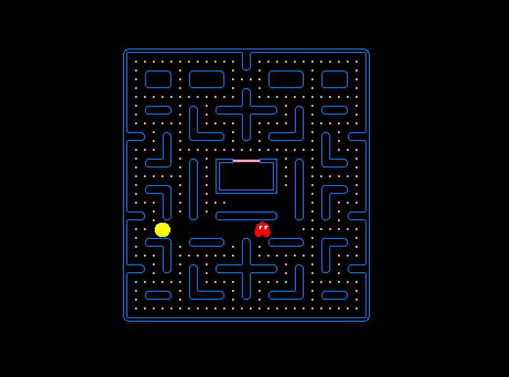

# Pac-Man Game

A 2D Pac-Man game built with Unity Engine and C# -- featuring player-controlled movement, AI ghost pathfinding, and classic arcade gameplay mechanics.


> Project Assignment 3 -- Computer Game Development and Animation, [NIT Warangal](https://nitw.ac.in/) (Winter 2021)

## Overview

A faithful recreation of the classic Pac-Man arcade game built in Unity Engine. The player navigates Pac-Man through an enclosed maze, eating dots while avoiding four colored ghosts. The game implements smooth movement with raycasting-based collision detection, ghost AI with predefined patrol patterns, and score tracking.



## Gameplay

- **Objective**: Eat all dots placed in the maze
- **Controls**: Arrow keys for directional movement
- **Win Condition**: Collect every dot in the maze
- **Lose Condition**: Contact with any ghost

### Ghost Characters

| Ghost | Color | Behavior |
|-------|-------|----------|
| Blinky | Red | Aggressive chaser |
| Pinky | Pink | Ambush positioning |
| Inky | Cyan | Unpredictable movement |
| Clyde | Orange | Random patrol pattern |

## Tech Stack

| Component | Technology |
|-----------|-----------|
| Game Engine | Unity Engine |
| Language | C# (MonoBehaviour) |
| Editor | Visual Studio Code |
| Physics | Unity 2D Raycasting |

## Project Structure

```
PacMan-Game__UnityEngine/
├── Scripts/
│   ├── PacmanMove.cs       # Player movement, input handling, collision
│   ├── GhostMove.cs        # Ghost AI patrol patterns and speed
│   └── Pacdot.cs           # Dot positions, collection, and score
├── images/
│   └── Gameplay.png        # Gameplay screenshot
└── README.md
```

## Script Details

### PacmanMove.cs
- Smooth grid-based movement using `Vector2.MoveTowards()`
- Keyboard input handling (arrow keys)
- Raycasting for wall collision detection
- Animation parameter updates for directional sprites
- Movement validation before each step

### GhostMove.cs
- Predefined waypoint-based movement paths for each ghost
- Individual movement speeds per ghost
- Continuous patrol behavior with path cycling

### Pacdot.cs
- Dot position management on the grid
- Collision-triggered destruction on Pac-Man contact
- Score increment on collection

## How to Play

### Download and Play

1. [Download from Google Drive](https://drive.google.com/drive/folders/1rtoV7bDruZvq4FiP_SG6LGwlsATjVSff?usp=sharing) (includes playable build + source code)
2. Extract `Pac-Man Build.zip`
3. Run `Pac-man 2D.exe`

### Build from Source

1. Clone this repository
2. Open the project in Unity Editor (2021.x+)
3. Open the main scene
4. Press Play in the Unity Editor or build for your platform

## License

MIT
